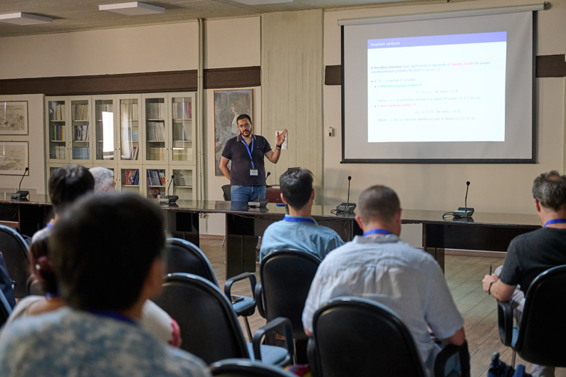

::: {.text-center}
{width="65%"}
:::

### Talks and Seminars

- [*Shock wavefronts for parabolic equations with sign-changing diffusivity*]{.talk-title}, Nonlinear Differential Equations: Control, Delay, and Boundary Value Problems, AIMS 2026 Conference, Athens, Greece, July 9, 2026. [Slides](slides/Berti_aims2026_s124.pdf){target="_blank"}

- [*Varadhan-type asymptotics for boundary data with localized support*]{.talk-title}, Geometry of PDEs on Manifolds and Nilpotent Lie Groups, AIMS 2026 Conference, Athens, Greece, July 6, 2026. [Slides](slides/Berti_aims2026_s65.pdf){target="_blank"}

- [*Regularity results on $3D$ viscous Tropical Climate Model*]{.talk-title}, Evolutionary Equations Systems, AIMS 2024 Conference, New York University Abu Dhabi, Abu Dhabi, UAE, December 19, 2024. [Slides](slides/Berti_aims2024.pdf){target="_blank"}

- [*Wavefronts in Biased Population Dynamics*]{.talk-title}, Diffusion Processes in Population Dynamics and Biology, Equadiff 2024, Karlstad University, Karlstad, Sweden, June 13, 2024. [Slides](slides/Berti_Equadiff2024.pdf){target="_blank"}

- [*The role of convection in the existence of Wavefronts for population dynamics with bias in movements*]{.talk-title}, Giornata di Benvenuto, Dipartimento di Matematica "Giuseppe Peano", Università degli Studi di Torino, Italy, November 9, 2023. [Slides](slides/Berti_9Nov23.pdf){target="_blank"}

- [*A regularity criterion for a $3D$ tropical climate model with damping*]{.talk-title}, Seminari di Analisi, Dipartimento di Matematica e Informatica "Ulisse Dini", Università degli Studi di Firenze, Italy, May 27, 2022. [Slides](slides/Berti_Firenze_27May22.pdf){target="_blank"}

- [*Multiplicity of traveling waves to bistable problems with negative diffusivity*]{.talk-title}, Two Days Workshop in Nonlinear Analysis 2021, online, September 3, 2021. [Slides](slides/Berti_TDWNA2021.pdf){target="_blank"}

- [*Wavefronts for degenerate diffusion-convection reaction equations with sign-changing diffusivity*]{.talk-title}, Methods of Nonlinear Analysis in Differential and Integral Equations, Rzeszów University of Technology, Poland, online, May 16, 2021. [Slides](slides/MNA-2021.pdf){target="_blank"}

- [*Wavefronts for degenerate diffusion-convection reaction equations*]{.talk-title}, Seminari di Analisi @ Unife, Ferrara, Italy, online, April 29, 2021. [Slides](slides/Ferrara_04_15.pdf){target="_blank"}

- [*Short-time asymptotics for solutions of the evolutionary game-theoretic $p$-Laplacian and Pucci operators*]{.talk-title}, XXI Congresso dell'Unione Matematica Italiana, Università di Pavia, Italy, September 4, 2019. [Slides](slides/Pavia24Luglio2019.pdf){target="_blank"}

- [*Short-time asymptotics for solutions of the evolutionary game-theoretic $p$-Laplacian and Pucci operators*]{.talk-title}, 12th ISAAC Congress, University of Aveiro, Portugal, July 30, 2019. [Slides](slides/Aveiro2019DiegoBerti.pdf){target="_blank"}

- [*Asymptotic analysis and symmetry results of solutions related to the game-theoretic $p$-Laplacian*]{.talk-title}, Joint Firenze–Tohoku Research Workshop on Nonlinear PDEs, Dipartimento di Matematica e Informatica "Ulisse Dini", Università degli Studi di Firenze, Italy, October 22, 2018.

- [*Short-time behaviour for game-theoretic $p$-caloric functions*]{.talk-title}, 15th Aoba-yama Seminar: PDEs and Inverse Problems, Tohoku University, Sendai, Japan, February 22, 2018.

- [*Asymptotic behaviour of solutions for certain boundary problems for the normalized $p$-Laplacian*]{.talk-title}, PDEs–Calculus of Variations Seminars, Dipartimento di Matematica e Informatica "Ulisse Dini", Università degli Studi di Firenze, Italy, April 1, 2016.

- [*Asymptotic behaviour of solutions for certain boundary problems for the normalized $p$-Laplacian*]{.talk-title}, Firenze–Sendai Seminars, Tohoku University, Sendai, Japan, January 28, 2016.

### Poster Presentations

- [*On Hamilton-Jacobi equations for the $N$-body problem*]{.talk-title}, Modeling, Control and Games through Partial Differential Equations, Ferrara, Italy, September 3, 2025. [Poster](slides/PosterSettembre2025_v4.pdf){target="_blank"}

- [*On regularized three-dimensional tropical climate models*]{.talk-title}, International Workshop on Nonlinear Differential Problems, Giardini Naxos (Messina), Italy, September 21, 2022. [Poster](slides/PosterSettembre2022-a0.pdf){target="_blank"}

- [*Asymptotic analysis of solutions of boundary problems for the game-theoretic $p$-Laplacian*]{.talk-title}, Sobolev Spaces and Partial Differential Equations, in honour of Vladimir Maz'ya on the occasion of his 80th birthday, Accademia dei Lincei, Palazzo Corsini, Rome, Italy, May 17, 2018. [Poster](slides/PosterRoma2018.pdf){target="_blank"}

- [*Short-time behaviour for game-theoretic $p$-caloric functions*]{.talk-title}, Geometry of PDE's and Related Problems, Cetraro (Cosenza), Italy, June 22, 2017.

- [*Asymptotic behaviour of solutions for certain boundary problems for the normalized $p$-Laplacian*]{.talk-title}, Geometric Aspects of PDE's and Functional Inequalities, Palazzone di Cortona, Cortona (Arezzo), Italy, April 29, 2016.